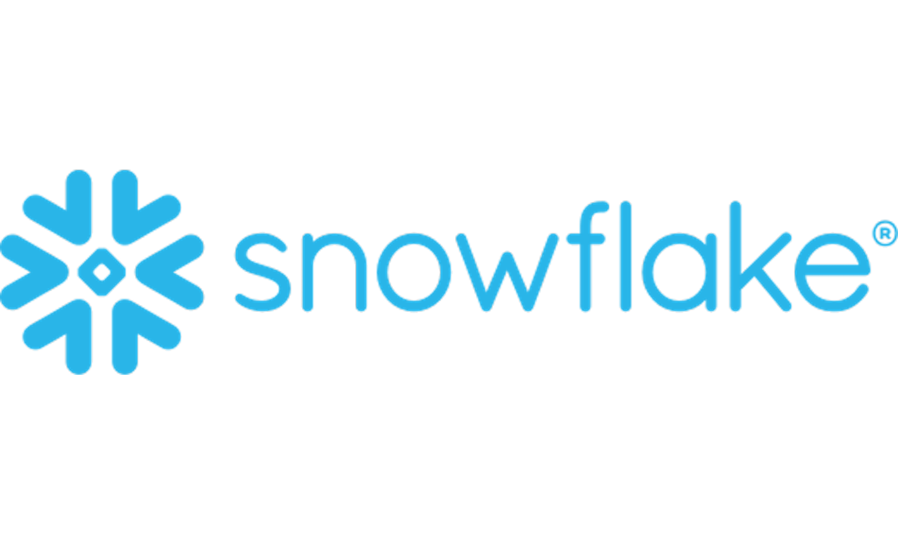
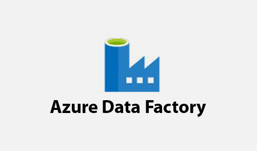

<h1 align="center">Shashank Rallapalli 👨🏻‍💻📊</h1>

### Connect:   

<em> <a href = https://learn.microsoft.com/en-gb/users/shashankr-1148/credentials/3132fb0910b417ae?ref=https%3A%2F%2Fwww.linkedin.com%2F> Microsoft Certified Power BI Data Analyst</a></em> 
<em>Masters at <a href="https://www.northeastern.edu/">Northeastern University</a>
</em>

### Hi there 👋
My name is Shashank Rallapalli, and I am a Data Analyst and Machine Learning Enthusiast.

I thrive on solving complex problems, particularly when the solutions exceed user expectations and deliver meaningful insights. My work often bridges the gap between data analysis and business strategy, using tools like Power BI, SQL, Python, and Snowflake etc. I have a strong passion for Machine Learning and AI, leveraging these technologies to drive innovation and efficiency.

I believe in the power of data to transform businesses and the importance of sharing knowledge to foster growth and innovation in the industry. As a proponent of automation, I consistently seek ways to streamline processes, and as a technology enthusiast, I stay at the forefront of advancements in analytics and AI.

In my spare time, I enjoy exploring the latest trends in AI and developing predictive models to solve real-world challenges, always aiming to contribute to the creation of impactful and intelligent systems.

## Been a part of

	&nbsp
	&nbsp
	&nbsp

  

## Languages & Tools:

	
	
	
	
	
	
	
	
        
   	
	
	

<h2 align="Left">Interests/Expertise</h2>

- Data Analytics
- Business Analysis
- Data Science
- Statical Data Analysis
- Time Series Analysis
- Data mining, Data wrangling
- NLP
- Image Classification
- Machine learning
- Large Language Models

<h2 align="Left">Py Libraries</h2>

- Numpy
- Pandas
- Matplotlib and Seaborn
- TensorFlow
- Sklearn
- PyTorch

<!--
**ShashankRallapalli25/ShashankRallapalli25** is a ✨ _special_ ✨ repository because its `README.md` (this file) appears on your GitHub profile.

Here are some ideas to get you started:

- 🔭 I’m currently working on ...
- 🌱 I’m currently learning ...
- 👯 I’m looking to collaborate on ...
- 🤔 I’m looking for help with ...
- 💬 Ask me about ...
- 📫 How to reach me: ...
- 😄 Pronouns: ...
- ⚡ Fun fact: ...
-->
